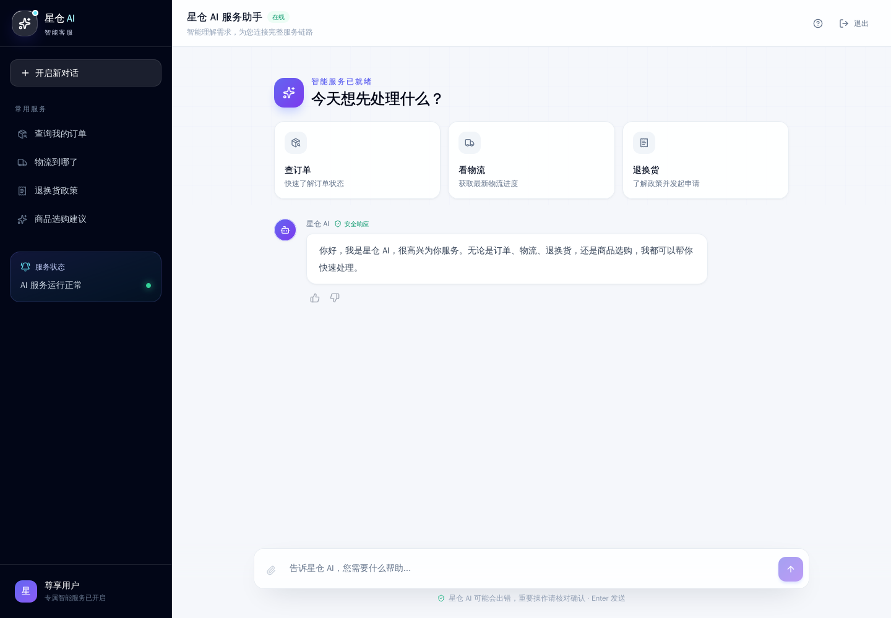
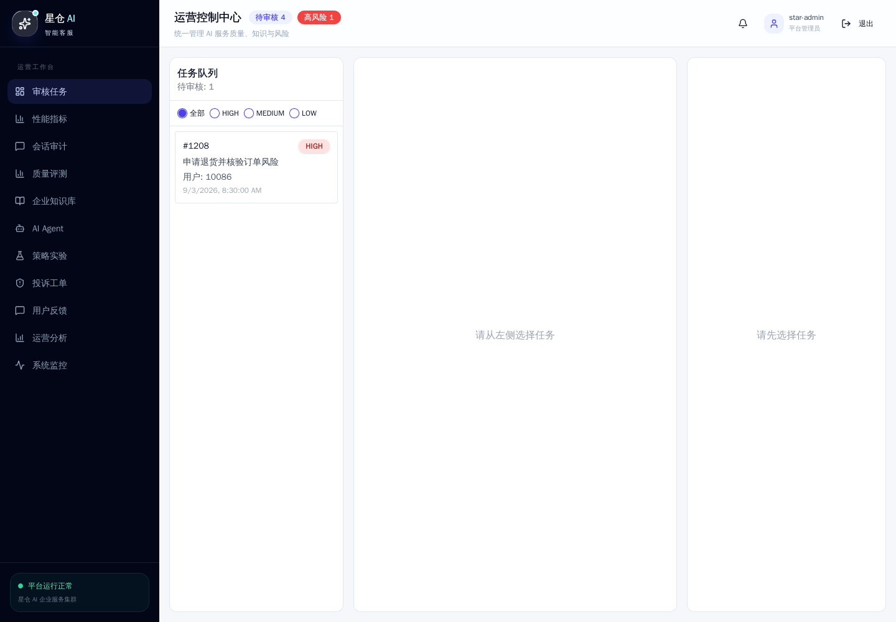
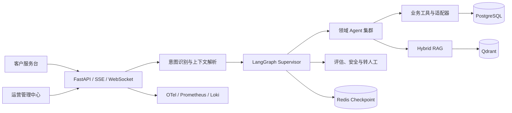

# 星仓 AI 智能客服

> Star Warehouse AI · 面向真实电商服务链路的原生 AI 客服平台

[](https://github.com/netking250/star-warehouse-ai/actions/workflows/ci.yml)


星仓 AI 智能客服是一套可运行、可评估、可观测的全栈 AI 客服系统。它不是一个只会回答问题的聊天窗口：系统会识别多意图、编排领域 Agent、调用业务工具、检索企业知识、保存多层记忆，并对高风险结果执行安全审查或转人工。

项目同时提供客户服务台和运营管理中心，覆盖从会话接入到质量治理的完整闭环，适合作为原生 AI 应用架构、Agent 工程化与全栈交付能力的作品集项目。

## English summary

Star Warehouse AI is a production-oriented, full-stack AI customer service platform for commerce workflows. It combines LangGraph orchestration, specialist agents, hybrid RAG, durable memory, human review, safety controls, evaluation, and end-to-end observability in one runnable system.

## 产品界面

| 客户服务台 | 运营管理中心 |
| --- | --- |
|  |  |

## 为什么是“原生 AI”

- **Agent 是业务执行层**：订单、商品、购物车、支付、物流、账户、政策和投诉由专职 Agent 与工具协同处理。
- **工作流可控**：LangGraph 负责路由、并行多意图、结果合成、置信度评估与失败收敛，不把关键流程藏在单次 Prompt 中。
- **知识与记忆分层**：PostgreSQL 保存结构化业务数据与用户事实，Qdrant 承载 Dense + Sparse 混合检索，Redis 管理缓存、会话态与检查点。
- **安全默认开启**：租户隔离、PII 过滤、内容审核、风险分级、确认机制和人工审核共同约束模型行为。
- **质量可以度量**：离线评估、对抗测试、影子测试、用户反馈、Token 成本和 OpenTelemetry 链路形成持续改进闭环。

## 核心能力

| 能力域 | 实现 |
| --- | --- |
| Agent 编排 | LangGraph Supervisor、意图路由、串并行多 Agent、结果评估与合成 |
| 企业知识 | Qdrant 混合检索、BM25 稀疏向量、Dense Embedding、重排、引用元数据 |
| 业务工具 | 订单、商品、购物车、支付、物流、账户、投诉等异步工具与适配器 |
| 会话与记忆 | PostgreSQL 持久化、Redis Checkpoint、结构化记忆、向量记忆、摘要与压缩 |
| 风险治理 | 置信度、PII 过滤、四层内容安全、人工审核、SLA 与告警 |
| 运营后台 | 知识库、Agent 配置、反馈、分析、评估、告警与审核工作台 |
| 可观测性 | OpenTelemetry、Prometheus、Grafana、Loki、Tempo、结构化日志 |
| 工程质量 | Ruff、ty、pytest、Vitest、Playwright、Docker Smoke、分层 GitHub Actions |

## 系统架构



更完整的节点职责、数据流和部署边界见[架构文档](docs/explanation/architecture/README.md)。

## 快速开始

### 环境要求

- Docker Engine 与 Docker Compose
- 至少一个可用的模型 API Key（OpenAI 兼容接口或 DashScope）
- 本地开发时使用 Python 3.12+、uv、Node.js 22+

### Docker 一键启动

```bash
git clone https://github.com/netking250/star-warehouse-ai.git
cd star-warehouse-ai
cp .env.example .env
# 编辑 .env，至少设置模型 API Key、数据库密码和 SECRET_KEY
./start_docker.sh
```

启动后访问：

- 客户服务台：<http://localhost:8000/app>
- 运营管理中心：<http://localhost:8000/admin>
- 健康检查：<http://localhost:8000/health>
- OpenAPI：<http://localhost:8000/docs>（需启用 `ENABLE_OPENAPI_DOCS`）

### 本地开发

```bash
# 后端
uv sync --frozen
uv run alembic upgrade head
uv run uvicorn app.main:app --reload --host 0.0.0.0 --port 8000

# 前端
cd frontend
npm ci
npm run dev
```

完整环境说明见[快速开始](docs/tutorials/quickstart.md)与[本地开发](docs/tutorials/local-development.md)。

## 验证与质量门禁

```bash
uv run ruff check app tests
uv run ruff format --check app tests
uv run ty check --error-on-warning app tests
uv run pytest --cov=app --cov-fail-under=75

cd frontend
npm run format:check
npm run lint
npm run test
npm run build
npm run test:e2e
```

主 CI 对品牌与文档、后端静态质量、后端测试、前端测试/E2E、Docker 启动进行分层验证。评估、性能和监控配置验证使用独立工作流。

## 项目结构

```text
app/                    FastAPI、LangGraph、Agent、工具、检索、记忆与治理
frontend/               React 客户服务台与运营管理中心
tests/                  后端单元、集成、评估、安全与性能测试
docs/                   Diátaxis 文档中心
migrations/             Alembic 数据库迁移
prometheus/ grafana/    指标、告警与可视化配置
scripts/                数据初始化、ETL 与运维工具
```

## 文档导航

- [文档中心](docs/README.md)
- [系统架构](docs/explanation/architecture/README.md)
- [环境变量](docs/reference/environment-variables.md)
- [API 参考](docs/reference/api.md)
- [部署指南](docs/how-to-guides/deploy.md)
- [故障排查](docs/how-to-guides/troubleshoot.md)
- [v5 品牌迁移指南](docs/how-to-guides/migrate-to-v5.md)
- [版本记录](CHANGELOG.md)

## v5 兼容策略

v5 不更改现有 REST 路径或数据库表结构。已知旧版 `PROJECT_NAME` 会在加载时规范化为“星仓 AI 智能客服”；Grafana 在整个 v5 生命周期内同时读取新旧服务标签，确保历史监控连续。新产生的运行时标识、日志、追踪和告警统一使用 `star-warehouse-ai`。

## 参与贡献

提交前请阅读 [AGENTS.md](AGENTS.md) 中的工程约束，并使用 Conventional Commits。架构、工作流或依赖边界发生变化时，需要同步更新对应的 `AGENTS.md` 与文档。
