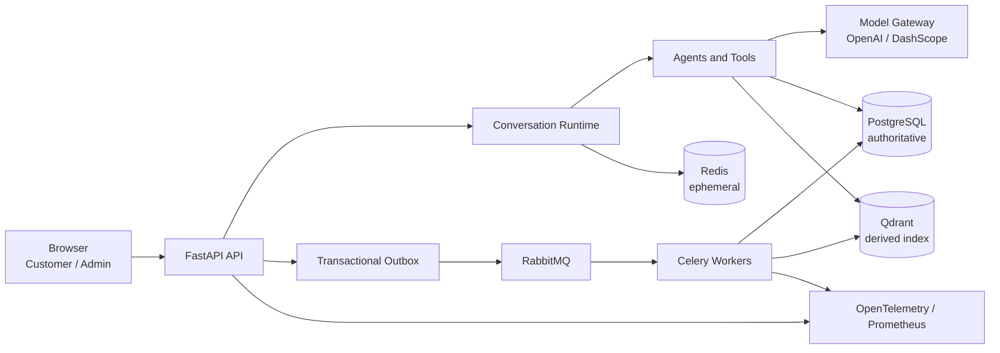

# Star Warehouse AI

**星仓 AI 智能客服** is an enterprise-style, multi-tenant AI customer-service and agent platform. It combines a customer conversation application with an operator console, persisted commerce workflows, retrieval-augmented knowledge, approval boundaries, evaluation, and operational controls.

The repository package version is `5.0.0`. **V1.2 / Project Bootstrap & Documentation Consolidation** is the accepted change baseline on main; it is not a new semantic package release. See the [final acceptance baseline](docs/engineering/FINAL_ACCEPTANCE.md). The project is a validated engineering portfolio and reference implementation, not a claim of live production operation.

## What It Is

Star Warehouse AI is a modular monolith with separately runnable API, tenant worker, maintenance worker, scheduler, and transactional-outbox relay roles. Browser sessions, business records, knowledge metadata, and async intent use real application paths. The bundled local/UAT dataset is synthetic but persisted; it is never described as customer or production data.

## Product Capabilities

- Customer conversational service for orders, logistics, payment, refunds, accounts, products, carts, policies, and complaints.
- Multi-turn LangGraph runtime with intent routing, tool boundaries, memory, confidence signals, and human-review transitions.
- Tenant-owned PostgreSQL business data and row-level security (RLS).
- Repository-backed knowledge ingestion, hybrid dense/sparse Qdrant retrieval, and tenant-filtered product search.
- Admin console for operations, knowledge, agent/model configuration, evaluation, access control, compliance, and observability.
- Provider-neutral model gateway for OpenAI and DashScope/Bailian, plus a deterministic Mock provider for tests and evaluation.
- Transactional outbox, RabbitMQ, Celery workers, idempotent task receipts, retries, and recovery controls.
- HttpOnly browser sessions, session-bound CSRF, capability authorization, lifecycle compliance, and supply-chain gates.

## Screens / Applications

- **Customer app** (`/app`): authenticated conversational support and persisted customer workflows.
- **Admin console** (`/admin`): capability-gated operational, knowledge, AI configuration, quality, security, and compliance views.

The accepted V1.1 visual design is shared by both applications and is intentionally unchanged by the V1.2 bootstrap work.

## Architecture



See the [architecture overview](docs/explanation/architecture/README.md), [accepted decisions](docs/engineering/DECISIONS.md), and [guardrails](docs/architecture/ARCHITECTURE_GUARDRAILS.md).

## Technology Stack

- Python 3.12, FastAPI, SQLModel/SQLAlchemy, Alembic, LangGraph, LangChain, Celery.
- PostgreSQL 16, Redis Stack 7.4, RabbitMQ 3.13, Qdrant 1.16.
- React 19, TypeScript 6, Vite 8, Tailwind CSS, TanStack Query, Vitest, Playwright.
- OpenTelemetry, Prometheus, Grafana, Loki, Tempo, Alertmanager, and Pyroscope integrations.
- Docker Compose for local development; Helm/k3s and AWS deployment references.

Exact dependency constraints are in [`pyproject.toml`](pyproject.toml), [`uv.lock`](uv.lock), and [`frontend/package.json`](frontend/package.json).

## Persistence Model

| System | Runtime role | Data status | Bootstrap / recovery expectation |
| --- | --- | --- | --- |
| PostgreSQL | Tenants, identities, orders, refunds, approvals, conversations, knowledge metadata, outbox, receipts | **Authoritative and persistent** | Alembic creates the schema; back up business state |
| Qdrant | Knowledge chunks and product vectors | **Derived and persistent locally** | Rebuild from repository/source objects and PostgreSQL metadata |
| Redis | Cache, session revocation, rate limits, locks, carts, and checkpoints | **Ephemeral runtime state** | Health-check; never seed authoritative business records |
| RabbitMQ | Celery task transport | **Broker, not a business database** | Health-check queues and prove delivery through durable outbox/receipt records |

Keycloak and the monitoring stack are optional local profiles. They are not required for the default application bootstrap.

## Quick Start

Prerequisites: Git, Docker Desktop or Docker Engine with Compose v2, and a Bash environment. On Windows, run the commands from WSL with Docker Desktop WSL integration enabled.

```bash
git clone https://github.com/netking250/star-warehouse-ai.git
cd star-warehouse-ai
cp .env.example .env
```

Edit the ignored `.env` file:

1. Replace the PostgreSQL role passwords and `SECRET_KEY` placeholders.
2. Change both `LOCAL_BOOTSTRAP_*_PASSWORD` values.
3. Set `DASHSCOPE_API_KEY` (and optionally `EMBEDDING_API_KEY`) or configure an OpenAI route. The proven DashScope-compatible endpoint is `https://dashscope.aliyuncs.com/compatible-mode/v1`.
4. Keep `ENVIRONMENT=development` and `LOCAL_BOOTSTRAP_ENABLED=true` for the local/UAT dataset.

Then run the one canonical full-stack command:

```bash
./start_docker.sh
```

It validates Compose, waits for infrastructure, migrates to the single Alembic head, provisions and connects through least-privilege database roles, reconciles local/UAT business data, ingests repository knowledge through the real storage/indexing path, starts all application roles, and verifies login, RLS isolation, retrieval, Redis, and an outbox/RabbitMQ/Celery receipt.

The command is idempotent and does **not** remove volumes. Never use `docker compose down -v` against a development project containing data you need.

## Local Credentials

No account password is hard-coded in Python or printed by the bootstrap. The accounts come from these development-only variables in your ignored `.env`:

- `LOCAL_BOOTSTRAP_CUSTOMER_USERNAME` / `LOCAL_BOOTSTRAP_CUSTOMER_PASSWORD`
- `LOCAL_BOOTSTRAP_ADMIN_USERNAME` / `LOCAL_BOOTSTRAP_ADMIN_PASSWORD`
- `LOCAL_BOOTSTRAP_TENANT_ID`

Bootstrap refuses `ENVIRONMENT=production`, and does nothing unless `LOCAL_BOOTSTRAP_ENABLED=true`.

## URLs

Default full-Docker URLs:

- Customer: <http://localhost:8000/app>
- Admin: <http://localhost:8000/admin>
- API health: <http://localhost:8000/health>
- OpenAPI: <http://localhost:8000/docs> only when `ENABLE_OPENAPI_DOCS=True`
- RabbitMQ management: <http://localhost:15672>

Optional monitoring (`docker-compose.monitoring.yml`): Grafana <http://localhost:3000>, Prometheus <http://localhost:9090>, and Alertmanager <http://localhost:9093>. Host ports can be changed with the documented `*_HOST_PORT` variables for isolated disposable stacks.

## Data Bootstrap

[`scripts/bootstrap_local_data.py`](scripts/bootstrap_local_data.py) is the single canonical data entry point. It uses the current tenant-aware models and services to reconcile:

- one fictional local/UAT commerce tenant;
- customer and operator identities with real password hashing and capability roles;
- four coherent orders covering payment, shipment, delivery, refund eligibility, and a non-refundable category;
- one refund/review boundary, complaint state, agent configuration, and routing rules;
- repository-owned return, shipping, and product knowledge metadata and source objects;
- tenant-filtered Qdrant knowledge/product vectors;
- one harmless durable outbox event for worker delivery verification.

Re-running it updates the named local records without duplicating them. Test fixtures remain isolated and never depend on this dataset.

## Model Providers

Runtime model routes support OpenAI and DashScope/Bailian through the Model Gateway. API keys stay in `.env` or deployment secret storage and are never committed. Embeddings use `EMBEDDING_BASE_URL` and `EMBEDDING_API_KEY`, falling back to `DASHSCOPE_API_KEY` when the dedicated key is empty.

The Mock provider is intentionally retained for deterministic CI and evaluation. It is an engineering test dependency, not fabricated runtime business data. Real-provider tests are opt-in with `RUN_REAL_LLM_TESTS=true`.

## How To Use

Customer flow:

1. Sign in at `/app` with the configured local customer account.
2. Ask about `UAT-NO-2026092203` to exercise the persisted order/logistics path.
3. Ask a return or shipping-policy question to exercise tenant-filtered knowledge retrieval.
4. Start a refund/complaint flow to observe the accepted approval and state-change boundaries.

Admin flow:

1. Sign in at `/admin` with the configured operator account.
2. Inspect the non-empty Knowledge area and its synchronization status.
3. Review pending operations, agent/routing configuration, authorization memberships, evaluation, and security/compliance views.

The dataset is synthetic and designed for local development, browser E2E, integration checks, and portfolio demonstrations.

## Development

Exactly two local workflows are supported:

1. **Full Docker stack:** `./start_docker.sh` (recommended and verified path).
2. **Developer mode:** Docker infrastructure plus host API, workers, relay, scheduler, and Vite frontend.

Developer mode commands and Windows/WSL notes are in the [local development guide](docs/tutorials/local-development.md). Do not invent a third seed/startup path; use `scripts.bootstrap_local_data` whenever local persisted data must be reconciled.

## Tests

```bash
# Backend quality and full CI coverage gate
uv run ruff format --check app tests
uv run ruff check app tests
uv run ty check --error-on-warning app tests
uv run pytest --cov=app --cov-fail-under=75

# Frontend
cd frontend
npm run format:check
npm run lint
npm run test
npm run build
npm run test:e2e
```

Use focused tests during development. PostgreSQL tests require a database whose name begins with `test_`; generic task tests use in-memory Celery transport, while explicit RabbitMQ integration tests require an isolated test vhost. See [`tests/AGENTS.md`](tests/AGENTS.md).

## Observability

The API exports health and Prometheus metrics, and application roles emit structured logs and OpenTelemetry traces. Launch the optional local monitoring profile with the procedure in the [observability runbook](docs/runbooks/observability.md). Monitoring data is operational evidence, not authoritative business state.

## Deployment

- Docker Compose is the implemented local-development topology.
- The Helm chart and k3s workflow are validated deployment/reference topology, with documented disposable-environment evidence.
- AWS is a qualified reference architecture, not a live deployment claim.

Production-style releases require an immutable image digest. The repository never treats `latest` as a production release. See the [deployment guide](docs/how-to-guides/deploy.md).

## Security

- PostgreSQL runtime and maintenance logins are non-superuser, `NO BYPASSRLS`, and assume narrowly granted capability roles.
- Tenant context is explicit across PostgreSQL, Redis, Qdrant, storage, tasks, and WebSocket boundaries.
- Browser authentication uses a host-only HttpOnly cookie and an in-memory, session-bound CSRF token.
- Current-state RBAC and route inventory enforce admin capabilities without granting cross-tenant access.
- Pull requests run read-only quality/security workflows; trusted image publication and provenance are limited to trusted main/tag contexts.

## Project Validation

Evidence is scoped rather than generalized:

- P-UAT-03A final product-quality evidence passed **30/30 on the frozen synthetic Bailian UAT corpus**. This is not production-customer evidence or a broad model benchmark.
- Accepted main passed 1,920 backend tests with zero failures/errors and 81.85% coverage; frontend unit tests passed 63/63. Hosted Playwright succeeded with one test requiring a retry.
- CI produces machine-readable dependency, secret, SBOM, and container-scan artifacts, with trusted-only publication/provenance workflow boundaries.
- Deterministic provider-free evaluation protects workflow contracts; optional live-provider smoke measures only the configured bounded query.

See the [evidence index](docs/portfolio/EVIDENCE_INDEX.md), [case study](docs/portfolio/CASE_STUDY.md), and [execution log](docs/engineering/EXECUTION_LOG.md).

## Repository Structure

```text
app/                         FastAPI modular monolith and independently runnable roles
  adapters/                  Business-system ports and local/production adapters
  bootstrap/                 Guarded, idempotent local/UAT dataset orchestration
  conversation/              Durable conversation/turn/run lifecycle
  graph/                     LangGraph workflow runtime
  model_gateway/             Provider-neutral model routing
  outbox/ and task_runtime/  Durable async intent, relay, and receipts
  retrieval/ and storage/    Tenant knowledge ingestion and search boundaries
frontend/                    Customer and admin React applications
tests/                       Hermetic backend, integration, and policy tests
data/                        Repository-owned knowledge and product sources
migrations/                  Immutable Alembic history
scripts/                     Bootstrap, verification, deployment, and maintenance commands
deploy/helm/                 k3s/production-reference Helm chart
docs/                        Architecture, guides, evidence, runbooks, and execution ledgers
```

## Documentation

- [Documentation index](docs/README.md)
- [Local development](docs/tutorials/local-development.md)
- [Environment variables](docs/reference/environment-variables.md)
- [Architecture](docs/explanation/architecture/README.md)
- [Operations runbooks](docs/runbooks/README.md)
- [Current execution state](docs/engineering/PROJECT_STATE.md)

## Known Limitations

The local dataset is synthetic, knowledge object storage uses the accepted local compatibility path, PITR is not implemented, AWS remains reference-only, and bounded test/load evidence is not production capacity or HA evidence. Dependency/image findings remain visible rather than being waived. See the authoritative [known limitations](docs/engineering/KNOWN_LIMITATIONS.md).
