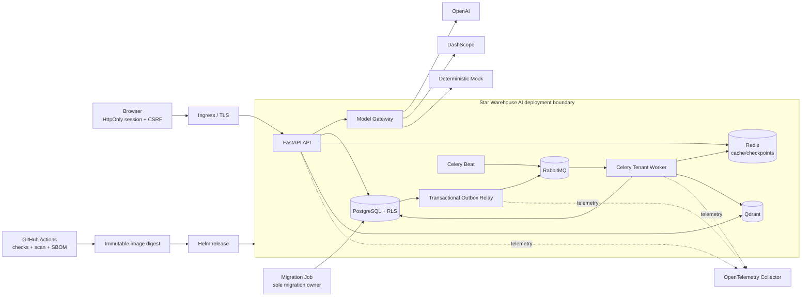

# Final System View

Star Warehouse AI remains a modular monolith. The API, tenant worker, scheduler, and outbox
relay are independently runnable roles from one codebase; this is a deployment boundary, not a
claim that they are separate microservices.

## Trust and data boundaries

- The browser authenticates with an HttpOnly application cookie; state-changing HTTP requests
  require session-bound CSRF, and WebSocket credentials are not put in a query string.
- A resolver creates the `TenantContext`. PostgreSQL binds the tenant transaction-locally and RLS
  is the database backstop; Redis, Qdrant, and local-storage keys use the same tenant namespace.
- A business transaction records an outbox event atomically. The relay publishes to RabbitMQ and
  workers use idempotent receipts because delivery is at least once.
- The Model Gateway owns provider-neutral requests and capabilities. T14 failure policy owns
  bounded retry, circuit state, ordered fallback, and explicitly safe degradation.
- Kubernetes startup does not run migrations. One Helm pre-install/pre-upgrade migration Job owns
  schema change, while API and workers consume the accepted schema.

See [accepted decisions](../../engineering/DECISIONS.md), the
[deployment architecture](deployment.md), and the [evidence index](../../portfolio/EVIDENCE_INDEX.md)
for the contracts and their measured proof.
