# 整体架构图

```mermaid
flowchart TB
    subgraph Frontend["🖥️ 前端层 (React + TypeScript)"]
        CUI["👤 Customer App\u003cbr/\u003e用户聊天界面\u003cbr/\u003eReact 19 + Vite"]
        ADM["🛡️ Admin Dashboard\u003cbr/\u003e管理员工作台\u003cbr/\u003eReact 19 + Vite"]
    end

    subgraph APILayer["📡 API 层 (FastAPI)"]
        API["FastAPI Application\u003cbr/\u003ePort: 8000"]

        subgraph Routers["🔀 路由模块"]
            AUTH["/api/v1/login\u003cbr/\u003e登录认证"]
            REGISTER["/api/v1/register\u003cbr/\u003e用户注册"]
            ME["/api/v1/me\u003cbr/\u003e当前用户"]
            CHAT["/api/v1/chat\u003cbr/\u003e聊天接口 (SSE)"]
            WS["/api/v1/ws/{thread_id}\u003cbr/\u003eWebSocket (用户)"]
            WS_ADMIN["/api/v1/ws/admin/{admin_id}\u003cbr/\u003eWebSocket (管理员)"]
            ADMIN["/api/v1/admin/*\u003cbr/\u003e管理员 API"]
            KB_ADMIN["/api/v1/admin/knowledge\u003cbr/\u003e知识库管理"]
            AGENT_CFG["/api/v1/admin/agents\u003cbr/\u003eAgent 配置中心"]
            COMPLAINT_ADMIN["/api/v1/admin/complaints\u003cbr/\u003e投诉工单"]
            FEEDBACK_ADMIN["/api/v1/admin/feedback\u003cbr/\u003e反馈评估"]
            EXPERIMENTS_ADMIN["/api/v1/admin/experiments\u003cbr/\u003eA/B 实验"]
            ANALYTICS_ADMIN["/api/v1/admin/analytics\u003cbr/\u003e高级分析"]
            EVAL_ADMIN["/api/v1/admin/evaluation/*\u003cbr/\u003e离线评估"]
            METRICS_ADMIN["/api/v1/admin/metrics\u003cbr/\u003e指标监控"]
            CONV_ADMIN["/api/v1/admin/conversations\u003cbr/\u003e会话日志"]
            STATUS["/api/v1/status/{thread_id}\u003cbr/\u003e状态查询"]
            FEEDBACK["/api/v1/feedback\u003cbr/\u003e用户反馈"]
        end
    end

    subgraph CoreLayer["⚙️ 核心层"]
        CONFIG["Config\u003cbr/\u003ePydantic Settings"]
        DB["Database\u003cbr/\u003eSQLModel + AsyncPG"]
        SEC["Security\u003cbr/\u003eJWT Auth"]
        UTILS["Utils\u003cbr/\u003e通用工具函数"]
        CONTEXT["Context\u003cbr/\u003eToken Budget / Observation Masking"]
        CONFIDENCE["Confidence\u003cbr/\u003e置信度信号计算"]
    end

    subgraph AgentLayer["🤖 Agent 层 (LangGraph)"]
        GRAPH["StateGraph\u003cbr/\u003e工作流编排"]

        subgraph Subgraphs["🧩 Agent Subgraphs"]
            SUB_POLICY["policy_agent\u003cbr/\u003eSubgraph"]
            SUB_ORDER["order_agent\u003cbr/\u003eSubgraph"]
            SUB_PRODUCT["product\u003cbr/\u003eSubgraph"]
            SUB_CART["cart\u003cbr/\u003eSubgraph"]
            SUB_LOGISTICS["logistics\u003cbr/\u003eSubgraph"]
            SUB_ACCOUNT["account\u003cbr/\u003eSubgraph"]
            SUB_PAYMENT["payment\u003cbr/\u003eSubgraph"]
            SUB_COMPLAINT["complaint\u003cbr/\u003eSubgraph"]
        end

        subgraph Nodes["📍 节点定义"]
            ROUTER_NODE["router_node\u003cbr/\u003e意图路由"]
            MEMORY_NODE["memory_node\u003cbr/\u003e记忆加载 / 摘要注入"]
            SUPERVISOR_NODE["supervisor_node\u003cbr/\u003e串行/并行调度"]
            SYNTHESIS_NODE["synthesis_node\u003cbr/\u003e多 Agent 回复融合"]
            EVALUATOR_NODE["evaluator_node\u003cbr/\u003e置信度评估"]
            DECIDER_NODE["decider_node\u003cbr/\u003e人工接管决策 / 回复生成 / 记忆抽取触发"]
        end

        subgraph ParallelExec["⚡ 并行执行器"]
            PLAN_DISPATCH["plan_dispatch\u003cbr/\u003e独立性判断"]
            BUILD_SENDS["build_parallel_sends\u003cbr/\u003eLangGraph Send"]
        end

        subgraph State["📦 状态定义"]
            AGENT_STATE["AgentState\u003cbr/\u003eTypedDict"]
        end
    end

    subgraph SafetyLayer["🛡️ 安全层"]
        OUTPUT_MOD["4层输出审核\u003cbr/\u003e规则+正则+语义+LLM"]
    end

    subgraph ServiceLayer["🛠️ 服务层"]
        REFUND_SVC["Refund Service\u003cbr/\u003e退货业务逻辑"]
        RULES["Refund Rules\u003cbr/\u003e退货规则引擎"]
    end

    subgraph AdapterLayer["🔌 业务系统适配层"]
        PORTS["10 Business Ports\u003cbr/\u003eIdentity / Product / Inventory / Order / Payment\u003cbr/\u003eInvoice / Logistics / Cart / Refund / Notification"]
        ADAPTERS["Local / Sandbox / Mock / Production HTTP\u003cbr/\u003e统一 DTO、错误、超时、重试、熔断、审计"]
        PORTS --> ADAPTERS
    end

    subgraph TaskLayer["⏳ 任务层 (Celery)"]
        CELERY["Celery Worker\u003cbr/\u003e异步任务队列"]
        REFUND_TASKS["Refund Tasks\u003cbr/\u003e- 发送短信\u003cbr/\u003e- 处理退款\u003cbr/\u003e- 通知管理员"]
        KB_TASKS["Knowledge Tasks\u003cbr/\u003e- 知识库 ETL 同步"]
        MEM_TASKS["Memory Tasks\u003cbr/\u003e- 事实抽取\u003cbr/\u003e- 记忆同步"]
        EVAL_TASKS["Evaluation Tasks\u003cbr/\u003e- 离线评估\u003cbr/\u003e- Prompt 效果报告"]
        SHADOW_TASKS["Shadow Tasks\u003cbr/\u003e- 影子测试"]
        CI_TASKS["Continuous Improvement\u003cbr/\u003e- 质量审计\u003cbr/\u003e- 告警"]
        NOTIFY_TASKS["Notification Tasks\u003cbr/\u003e- 邮件通知\u003cbr/\u003e- WebSocket 广播"]
    end

    subgraph WebSocketLayer["🔌 WebSocket 层"]
        WS_MGR["Connection Manager\u003cbr/\u003e连接管理器"]
    end

    subgraph MemoryLayer["🧠 记忆层"]
        subgraph MemorySQL["PostgreSQL"]
            TBL_PROFILE[(user_profiles\u003cbr/\u003e用户画像)]
            TBL_PREF[(user_preferences\u003cbr/\u003e用户偏好)]
            TBL_SUMMARY[(interaction_summaries\u003cbr/\u003e交互摘要)]
            TBL_FACT[(user_facts\u003cbr/\u003e原子事实)]
            TBL_AGENT_CFG[(agent_configs\u003cbr/\u003eAgent 配置)]
            TBL_AGENT_AUDIT[(agent_config_audit_logs\u003cbr/\u003e配置审计)]
            TBL_ROUTING[(routing_rules\u003cbr/\u003e路由规则)]
            TBL_COMPLAINT[(complaint_tickets\u003cbr/\u003e投诉工单)]
            TBL_FEEDBACK[(message_feedbacks\u003cbr/\u003e用户反馈)]
        end

        subgraph MemoryVec["Qdrant"]
            VEC_CONV[(conversation_memory\u003cbr/\u003e对话向量记忆)]
        end

        MEM_MGR["Memory Managers\u003cbr/\u003eStructured / Vector / Extractor / Summarizer"]
    end

    subgraph DataLayer["💾 数据层"]
        subgraph PostgreSQL["🐘 PostgreSQL"]
            TBL_USERS[(users\u003cbr/\u003e用户表)]
            TBL_ORDERS[(orders\u003cbr/\u003e订单表)]
            TBL_REFUNDS[(refund_applications\u003cbr/\u003e退款申请表)]
            TBL_AUDIT[(audit_logs\u003cbr/\u003e审计日志表)]
            TBL_MSG[(message_cards\u003cbr/\u003e消息卡片表)]
            TBL_KB[(knowledge_documents\u003cbr/\u003e知识库文档表)]
            TBL_EXPERIMENTS[(experiments\u003cbr/\u003eA/B 实验)]
            TBL_EXPERIMENT_VAR[(experiment_variants\u003cbr/\u003e实验变体)]
            TBL_EXPERIMENT_ASSIGN[(experiment_assignments\u003cbr/\u003e实验分配)]
            TBL_GRAPH_LOG[(graph_execution_logs\u003cbr/\u003e图执行日志)]
            TBL_GRAPH_NODE[(graph_node_logs\u003cbr/\u003e节点日志)]
            TBL_QUALITY[(quality_scores\u003cbr/\u003e质量评分)]
        end

        subgraph Qdrant["🔷 Qdrant"]
            VEC_KNOWLEDGE[(knowledge_chunks\u003cbr/\u003e向量知识库)]
            VEC_PRODUCT[(product_catalog\u003cbr/\u003e商品目录向量库)]
        end

        subgraph Redis["🔴 Redis"]
            REDIS_CACHE["Session Cache\u003cbr/\u003e状态缓存"]
            REDIS_CART["购物车缓存\u003cbr/\u003ecart:{user_id}"]
            REDIS_CELERY["Celery Broker\u003cbr/\u003e任务队列"]
            REDIS_CHECK["LangGraph Checkpoint\u003cbr/\u003e检查点"]
        end
    end

    subgraph External["🌐 外部服务"]
        LLM["LLM API\u003cbr/\u003e通义千问/Qwen"]
        EMBED["Embedding API\u003cbr/\u003e文本嵌入"]
        BUSINESS["ERP / OMS / 商品 / 库存 / 支付 / 物流 API"]
    end

    CUI <-->|"HTTP/SSE"| API
    ADM <-->|"HTTP"| API

    API --> Routers
    Routers --> CoreLayer
    Routers --> AgentLayer
    Routers --> ServiceLayer
    Routers --> WebSocketLayer

    CHAT --> GRAPH
    ADMIN --> REFUND_SVC
    KB_ADMIN --> KB_TASKS
    AGENT_CFG --> MemoryLayer
    COMPLAINT_ADMIN --> DB
    FEEDBACK_ADMIN --> DB
    EXPERIMENTS_ADMIN --> DB
    ANALYTICS_ADMIN --> DB
    EVAL_ADMIN --> DB
    METRICS_ADMIN --> DB
    CONV_ADMIN --> DB
    WS --> WS_MGR
    ADMIN --> TBL_EXPERIMENTS
    AGENT_CFG --> TBL_ROUTING

    GRAPH --> Nodes
    Nodes --> State
    Nodes --> ParallelExec
    Nodes --> Subgraphs

    ROUTER_NODE --> MEMORY_NODE
    MEMORY_NODE --> SUPERVISOR_NODE
    SUPERVISOR_NODE --> PLAN_DISPATCH
    PLAN_DISPATCH --> BUILD_SENDS
    BUILD_SENDS --> Subgraphs
    Subgraphs --> SYNTHESIS_NODE
    SYNTHESIS_NODE --> OUTPUT_MOD
    OUTPUT_MOD --> EVALUATOR_NODE
    EVALUATOR_NODE --> DECIDER_NODE
    EVALUATOR_NODE -->|"低置信度"| ROUTER_NODE

    REFUND_SVC --> RULES
    REFUND_SVC --> DB
    Subgraphs --> PORTS
    ServiceLayer --> PORTS
    ADAPTERS --> BUSINESS
    ADAPTERS --> DataLayer

    ServiceLayer -->|"高风险触发"| CELERY
    CELERY --> REFUND_TASKS
    CELERY --> KB_TASKS
    CELERY --> MEM_TASKS
    CELERY --> EVAL_TASKS
    CELERY --> SHADOW_TASKS
    CELERY --> CI_TASKS
    CELERY --> NOTIFY_TASKS
    KB_TASKS --> Qdrant
    CELERY -->|"记忆抽取"| MEM_MGR

    Nodes <-->|"Embedding/LLM"| External
    MEM_MGR <-->|"Embedding"| External

    DB --> PostgreSQL
    CELERY --> REDIS_CELERY
    GRAPH --> REDIS_CHECK
    REDIS_CART --> Redis
    MEM_MGR --> MemorySQL
    MEM_MGR --> MemoryVec
```

## 架构说明

Star Warehouse AI v5.0 采用多层架构：

1. **前端层**：React 19 + Vite 构建 C 端聊天界面与 B 端管理后台
2. **API 层**：FastAPI 提供 RESTful API、SSE 流式响应、WebSocket 连接
3. **核心层**：Pydantic 配置管理、SQLModel 数据库连接、JWT 安全认证、Token 预算与观察掩码、置信度信号计算
4. **Agent 层**：LangGraph 工作流编排，包含 Supervisor 调度、并行执行、记忆注入、置信度评估
5. **服务层**：Refund Service 处理退货规则与风控逻辑
6. **业务系统适配层**：10 类 Port 隔离 Agent 与权威业务系统，统一 DTO、错误与韧性策略；Local/Sandbox/Mock/Production 可在启动期替换
7. **任务层**：Celery 异步队列处理退款、短信、知识库同步、记忆抽取
8. **记忆层**：PostgreSQL 结构化记忆 + Qdrant 向量记忆
9. **安全层**：4 层输出内容审核（规则匹配、正则检测、语义相似度、LLM 评判）
10. **数据层**：PostgreSQL 业务数据 + Qdrant 向量数据 + Redis 缓存
11. **外部层**：通义千问/Qwen、Embedding 服务及生产 ERP/OMS 等权威业务 API

> 详细的技术栈说明请参考 [技术栈详情](../../reference/tech-stack-detail.md)。
