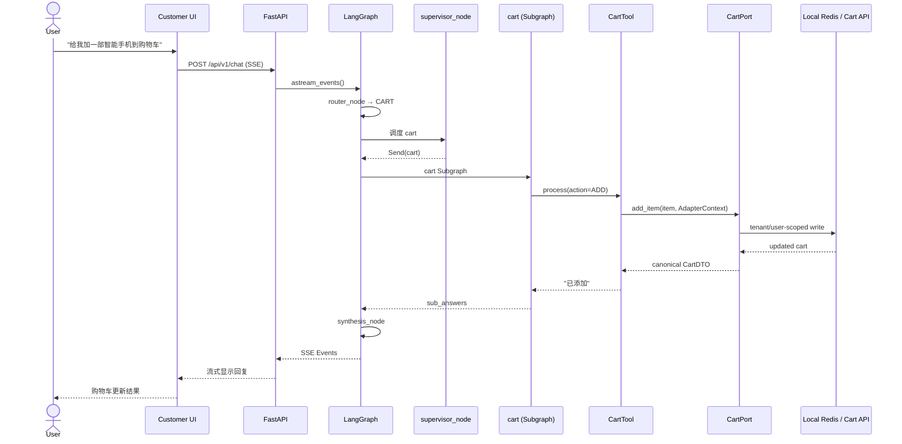

# 购物车管理流程

```mermaid
sequenceDiagram
    actor User
    participant CUI as Customer UI
    participant API as FastAPI
    participant Graph as LangGraph
    participant Supervisor as supervisor_node
    participant Node as cart (Subgraph)
    participant Tool as CartTool
    participant Port as CartPort
    participant Source as Local Redis / Cart API

    User->>CUI: "给我加一部智能手机到购物车"
    CUI->>API: POST /api/v1/chat (SSE)
    API->>Graph: astream_events()
    Graph->>Graph: router_node → CART
    Graph->>Supervisor: 调度 cart
    Supervisor-->>Graph: Send(cart)
    Graph->>Node: cart Subgraph
    Node->>Tool: process(action=ADD)
    Tool->>Port: add_item(item, AdapterContext)
    Port->>Source: tenant/user-scoped write
    Source-->>Port: updated cart
    Port-->>Tool: canonical CartDTO
    Tool-->>Node: "已添加"
    Node-->>Graph: sub_answers
    Graph->>Graph: synthesis_node
    Graph-->>API: SSE Events
    API-->>CUI: 流式显示回复
    CUI-->>User: 购物车更新结果
```
