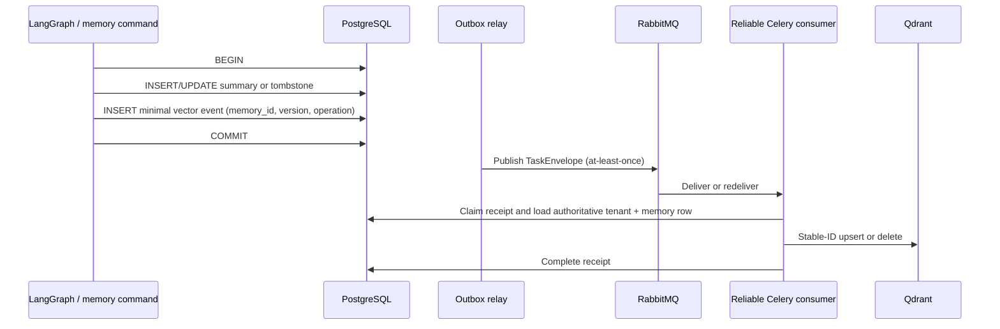

# Memory consistency and loading flow

PostgreSQL is authoritative for structured memory. Qdrant is a derived recall index and can be temporarily stale or unavailable without invalidating committed structured memory.

## Write and projection

The receipt lease can be recovered after a worker crash. A crash after Qdrant succeeds but before receipt completion can repeat the projection; the stable point identity makes that repetition idempotent. A delayed event whose version is older than PostgreSQL is ignored, so it cannot overwrite a newer summary or resurrect a tombstone.

## Read degradation

Structured memory and vector recall are loaded independently. If Qdrant fails, PostgreSQL-backed profile, preference, fact, and summary data remains available and `memory_context.vector_recall_degraded` is set. The response can therefore use authoritative structured memory while making the degraded vector-recall condition observable.

## Reconciliation

The tenant-scoped reconciliation command compares each PostgreSQL summary version with the Qdrant point version. Missing or mismatched active points enqueue an upsert; indexed tombstones enqueue a delete. The command only enqueues repair intent and leaves transaction commit ownership with its caller.
