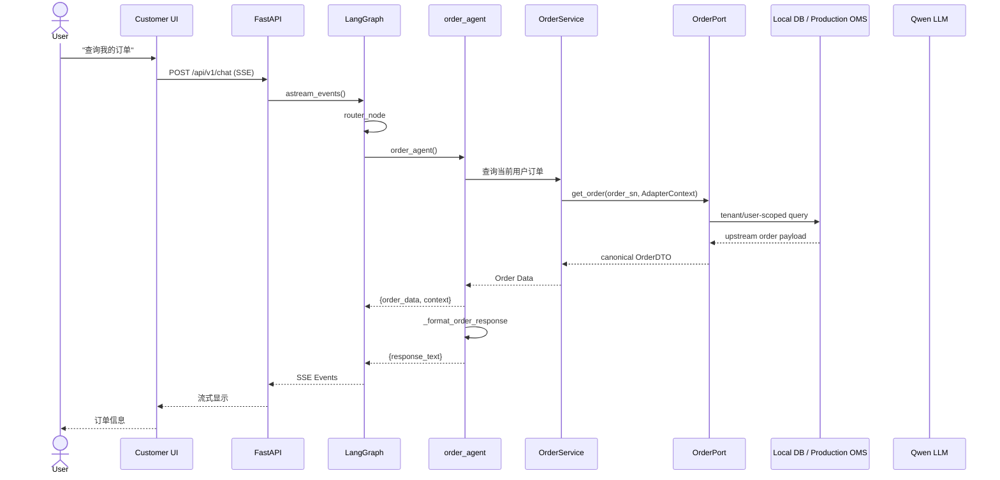

# 订单查询流程

```mermaid
sequenceDiagram
    actor User
    participant CUI as Customer UI
    participant API as FastAPI
    participant Graph as LangGraph
    participant Node as order_agent
    participant Service as OrderService
    participant Port as OrderPort
    participant Source as Local DB / Production OMS
    participant LLM as Qwen LLM

    User->>CUI: "查询我的订单"
    CUI->>API: POST /api/v1/chat (SSE)
    API->>Graph: astream_events()
    Graph->>Graph: router_node
    Graph->>Node: order_agent()
    Node->>Service: 查询当前用户订单
    Service->>Port: get_order(order_sn, AdapterContext)
    Port->>Source: tenant/user-scoped query
    Source-->>Port: upstream order payload
    Port-->>Service: canonical OrderDTO
    Service-->>Node: Order Data
    Node-->>Graph: {order_data, context}
    Node->>Node: _format_order_response
    Node-->>Graph: {response_text}
    Graph-->>API: SSE Events
    API-->>CUI: 流式显示
    CUI-->>User: 订单信息
```
