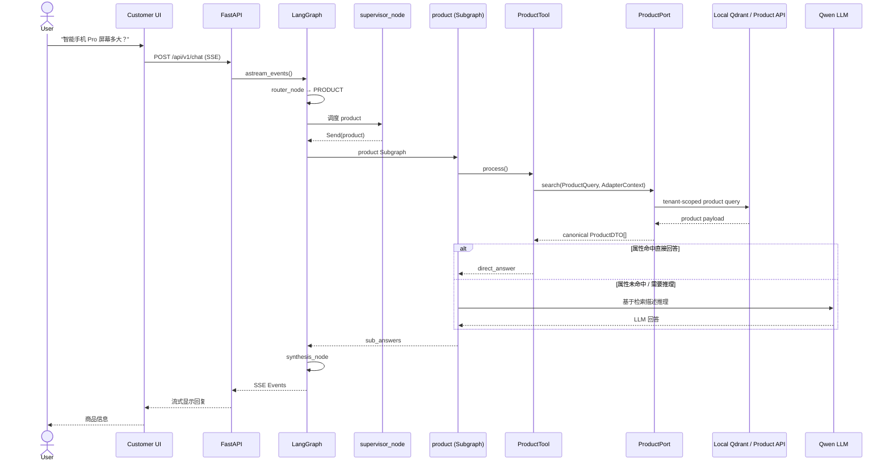

# 商品查询流程

```mermaid
sequenceDiagram
    actor User
    participant CUI as Customer UI
    participant API as FastAPI
    participant Graph as LangGraph
    participant Supervisor as supervisor_node
    participant Node as product (Subgraph)
    participant Tool as ProductTool
    participant Port as ProductPort
    participant Source as Local Qdrant / Product API
    participant LLM as Qwen LLM

    User->>CUI: "智能手机 Pro 屏幕多大？"
    CUI->>API: POST /api/v1/chat (SSE)
    API->>Graph: astream_events()
    Graph->>Graph: router_node → PRODUCT
    Graph->>Supervisor: 调度 product
    Supervisor-->>Graph: Send(product)
    Graph->>Node: product Subgraph
    Node->>Tool: process()
    Tool->>Port: search(ProductQuery, AdapterContext)
    Port->>Source: tenant-scoped product query
    Source-->>Port: product payload
    Port-->>Tool: canonical ProductDTO[]
    alt 属性命中直接回答
        Tool-->>Node: direct_answer
    else 属性未命中 / 需要推理
        Node->>LLM: 基于检索描述推理
        LLM-->>Node: LLM 回答
    end
    Node-->>Graph: sub_answers
    Graph->>Graph: synthesis_node
    Graph-->>API: SSE Events
    API-->>CUI: 流式显示回复
    CUI-->>User: 商品信息
```
